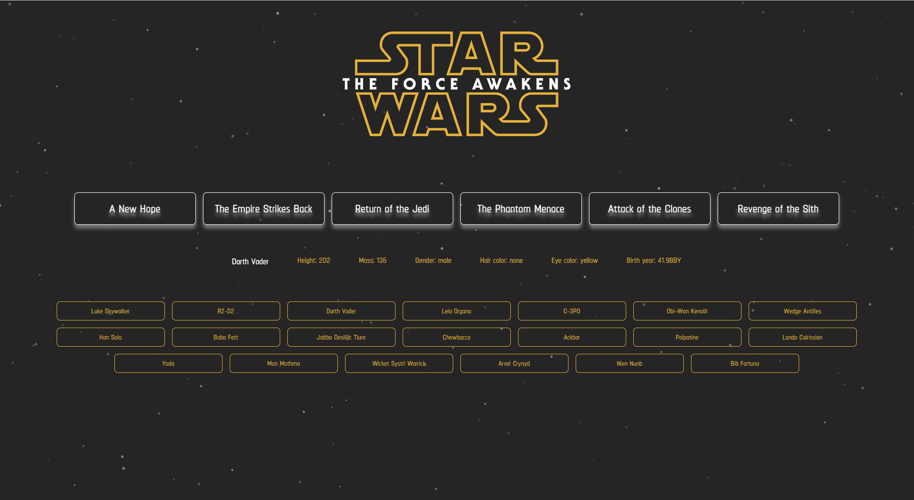
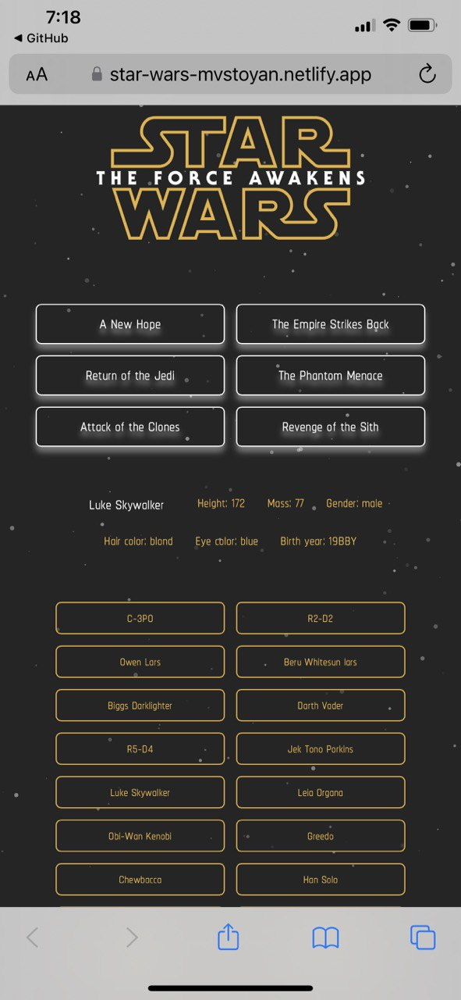

<h1><em><a href="https://star-wars-mvstoyan.netlify.app" target="_blank">STAR WARS API</a><em></h1>
    

  <h3>Features:</h3>
  
Pre-work for advanced classes in Code The Dream

    <ul>
      <li>Responsive, on all devices</li>
      
      
   </ul>

  <h3>Technologies Used</h3>
   <ul>
      <li><a href="https://www.w3schools.com/html/" target="_blank">HTML</a></li>
      <li><a href="https://www.w3schools.com/css/" target="_blank">CSS</a></li>
      <li><a href="https://javascript.info/" target="_blank">JavaScript</a></li>
      <li><a href="https://www.freecodecamp.org/news/how-to-make-api-calls-with-fetch/" target="_blank">Fetch API</a></li>
      <li><a href="https://www.geeksforgeeks.org/how-to-use-the-javascript-fetch-api-to-get-data/" target="_blank">Fetch API</a></li>
      <li><a href="https://www.javascripttutorial.net/javascript-fetch-api/" target="_blank">JavaScript Fetch API</a></li>
      <li><a href="https://www.swapi.tech/" target="_blank">Star Wars API</a></li>
      <li><a href="https://codepen.io/bob6664569" target="_blank">Stars Particles JavaScript</a></li>
      <li><a href="" target="_blank">Image Source</a></li>
   </ul>

  <h3>Website Demo</h3>

https://user-images.githubusercontent.com/95896159/217970464-ddb4d705-97c7-4d04-9a8f-99424164056f.mp4

